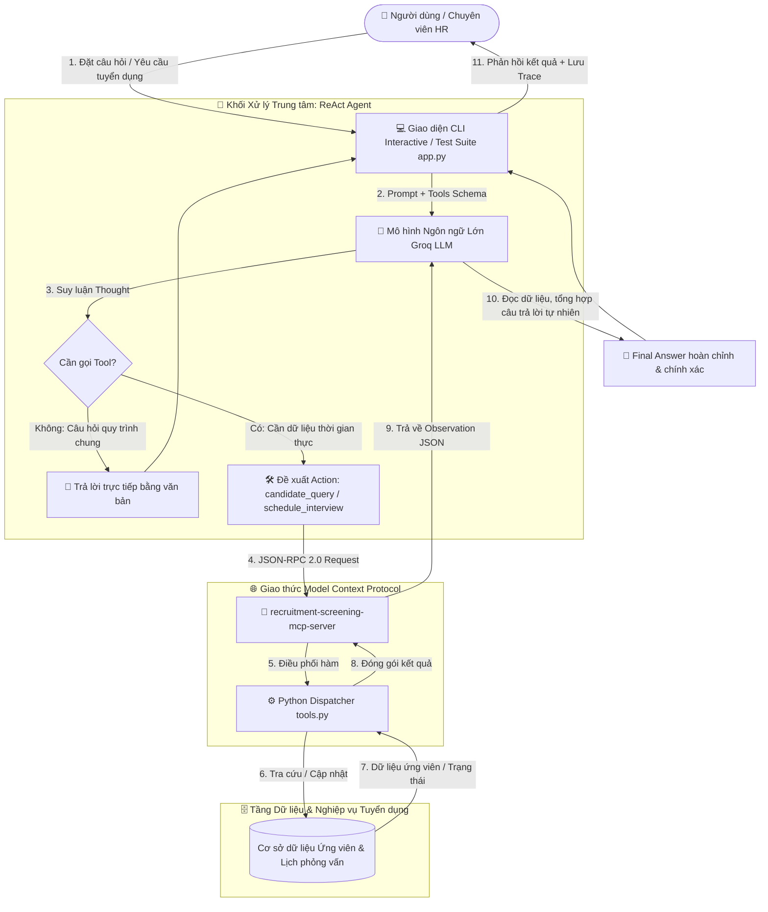

# 📋 BÁO CÁO THUYẾT TRÌNH DEMO & GIẢI THÍCH KIẾN TRÚC DỰ ÁN
**Môn học:** VinUni AI Course - Day 03: Chatbot vs ReAct Agent (MCP Enhanced)  
**Học viên:** Nguyễn Đức Đông | **MSSV:** 2A202602367  
**Giảng viên hướng dẫn:** Mr. Đặng Đức Huy (Dudumi)  
**Đề tài:** Trợ lý Tuyển dụng & Sàng lọc CV (Recruitment & CV Screening Assistant)  
**Repository:** [GitHub Project](https://github.com/nguyenducdong22/K4B-Day03-NGUYENDUCDONG-2A202602367)

---

## PHẦN 1: GIẢI MÃ YÊU CẦU THUYẾT TRÌNH TRÊN ẢNH (BẢNG DUDUMI)

Trên bảng ghi rõ **5 nội dung cốt lõi bắt buộc phải trình bày khi thuyết trình / bảo vệ Demo**:

| STT | Câu hỏi trên bảng | Hướng dẫn nội dung trình bày chuẩn xác |
|:---:|:---|:---|
| **1** | **Chọn đề tài gì? Tại sao chọn đề tài đó?** | • **Tên đề tài:** *Trợ lý Tuyển dụng & Sàng lọc CV (Recruitment & CV Screening Assistant)*.<br>• **Lý do chọn:** Trong doanh nghiệp, khâu tuyển dụng hàng nghìn hồ sơ thủ công tốn rất nhiều thời gian. Chatbot thông thường không thể tra cứu dữ liệu ứng viên theo thời gian thực hay tự động gửi lịch phỏng vấn. ReAct Agent giúp tự động hóa quy trình sàng lọc, đánh giá điểm CV khách quan và lên lịch phỏng vấn tức thì. |
| **2** | **Tại sao ReAct Agent Pattern lại phù hợp? (Show 4 tiêu chí Agentic Fit thang 5)** | Bài toán đạt **19/20 điểm** (Agentic Fit cực cao):<br>1. *Multi-step Reasoning (5/5):* Phải tra cứu hồ sơ -> đọc điểm CV -> kiểm tra điều kiện đạt -> mới quyết định lên lịch phỏng vấn.<br>2. *Tool / Data Dependency (5/5):* Bắt buộc phải kết nối CSDL tuyển dụng qua MCP Server, không thể trả lời bằng kiến thức tĩnh.<br>3. *Dynamic Control Flow (5/5):* Rẽ nhánh linh hoạt (đạt thì đặt lịch, rớt thì từ chối, sai mã thì báo lỗi).<br>4. *Anti-Hallucination (4/5):* Đọc dữ liệu thực tế từ Tool trả về, tuyệt đối không bịa đặt hồ sơ ứng viên. |
| **3** | **Kiến trúc Agent đã xây dựng (Show biểu đồ)** | Hệ thống gồm 4 lớp: **User Interface / CLI** ➔ **ReAct Agent Brain (Groq LLM)** ➔ **Giao thức MCP Server (JSON-RPC 2.0)** ➔ **Execution Backend & HR Database**. *(Xem biểu đồ chi tiết bên dưới)*. |
| **4** | **Sử dụng những tool gì? Nêu tác dụng từng tool** | Gồm 2 công cụ chuẩn Native JSON Schema:<br>• `candidate_query`: Tra cứu chi tiết hồ sơ ứng viên, vị trí, điểm CV, kỹ năng và kết quả sàng lọc ban đầu theo mã ứng viên.<br>• `schedule_interview`: Đặt lịch và gửi thông báo mời phỏng vấn tự động đến ứng viên và người phỏng vấn phụ trách. |
| **5** | **Demo với 1 - 2 câu hỏi trực tiếp, show trace log từng bước** | Demo trực tiếp trên CLI (`python src/app.py --interactive`):<br>• Câu 1 (Đơn bước): Tra cứu hồ sơ ứng viên `UV2026001`.<br>• Câu 2 (Đa bước): Kiểm tra ứng viên `UV2026001` có đạt không, nếu đạt thì đặt lịch phỏng vấn ngày 25/09/2026.<br>• Trình chiếu file `docs/trace_waterfall.json` thể hiện Thought ➔ Action ➔ Observation ➔ Final Answer. |

---

## PHẦN 2: CÔNG DỤNG VÀ TÁC DỤNG CỦA TỪNG FILE TRONG DỰ ÁN

Dự án được cấu trúc theo mô hình phân tầng module hóa chuẩn công nghiệp:

```
K4B-Day03-NGUYENDUCDONG-2A202602367/
├── config/
│   ├── test_cases.json          # 5 bộ dữ liệu kiểm thử tự động
│   └── test_cases.example.json  # File mẫu ban đầu của khóa học
├── docs/
│   ├── trace_eval.md            # Báo cáo chấm điểm Agentic Fit & log nghiệm thu
│   ├── trace_waterfall.json     # Dữ liệu trace observability (đo latency, thought, tool)
│   └── BAO_CAO_DEMO_VA_KIEN_TRUC.md # Báo cáo chi tiết bảo vệ demo
├── src/
│   ├── ai_levels/               # So sánh tiến hóa 3 cấp độ AI
│   │   ├── level1_regex_chatbot.py     # Cấp 1: Chatbot Regex đối sánh từ khóa
│   │   ├── level2_semantic_llm.py      # Cấp 2: Chatbot LLM ngữ nghĩa (không Tool)
│   │   └── level3_native_mcp_agent.py  # Cấp 3: ReAct Agent gọi Tool qua MCP
│   ├── app.py                   # Điểm khởi chạy chính: Điều phối ReAct Loop & CLI
│   ├── mcp_server.py            # Giả lập máy chủ giao thức MCP (JSON-RPC 2.0)
│   ├── prompts.py               # Chứa System Prompts cho Chatbot vs ReAct Agent
│   ├── providers.py             # Multi-Provider Adapter (Groq, OpenAI, Gemini)
│   └── tools.py                 # Khai báo Tool Schemas & hàm thực thi CSDL ứng viên
├── .env                         # Cấu hình API Key và cấu hình Model
├── .gitignore                   # Chặn commit file nhạy cảm (.env, .venv)
└── requirements.txt             # Khai báo các thư viện Python phụ thuộc
```

### 1. Thư mục `src/` (Mã nguồn cốt lõi)

#### 🔹 [src/app.py](file:///c:/Users/msi/Documents/Lap_VinUni/Lap3/K4B-Day03-NGUYENDUCDONG-2A202602367/src/app.py) — "Trái tim" điều phối chương trình
- **Công dụng:** Khởi tạo ReAct Agent, quản lý vòng lặp suy luận (`while step < MAX_ITERATIONS`), xử lý các chế độ chạy `--all` (chạy test suite) và `--interactive` (chat tương tác trực tiếp).
- **Tác dụng:**
  - Nhận câu hỏi người dùng ➔ Chuyển cho LLM phân tích kèm danh sách công cụ.
  - Khi LLM yêu cầu gọi Tool (`type == "tool_call"`), điều hướng qua MCP Server để thực thi.
  - Lấy kết quả (`Observation`) đưa ngược lại cho LLM để tự tổng hợp thành câu trả lời hoàn chỉnh (`Final Answer`).
  - Tự động ghi nhận toàn bộ bước chạy kèm độ trễ (latency ms) ra tệp `docs/trace_waterfall.json`.

#### 🔹 [src/tools.py](file:///c:/Users/msi/Documents/Lap_VinUni/Lap3/K4B-Day03-NGUYENDUCDONG-2A202602367/src/tools.py) — Khai báo & Thực thi Công cụ (Tool Engine)
- **Công dụng:** Chứa định nghĩa công cụ theo chuẩn Native JSON Schema và hàm dispatcher thực thi dữ liệu ứng viên.
- **Tác dụng:**
  - `TOOLS_SCHEMA`: Khai báo 2 tool `candidate_query` và `schedule_interview` giúp mô hình LLM hiểu được tham số đầu vào (`candidate_id`, `datetime_str`, `interviewer_name`).
  - `MOCK_DATABASE`: Cơ sở dữ liệu ứng viên (chứa thông tin ứng viên `UV2026001`, `UV2026002`, điểm CV, kinh nghiệm, kỹ năng).
  - `dispatch_tool_call()`: Hàm trung chuyển, nhận tên tool và tham số, gọi đúng hàm Python xử lý nghiệp vụ rồi trả về chuỗi JSON.

#### 🔹 [src/mcp_server.py](file:///c:/Users/msi/Documents/Lap_VinUni/Lap3/K4B-Day03-NGUYENDUCDONG-2A202602367/src/mcp_server.py) — Cầu nối Model Context Protocol (MCP Server)
- **Công dụng:** Đóng vai trò máy chủ MCP theo chuẩn giao thức JSON-RPC 2.0 kết nối giữa LLM và môi trường bên ngoài.
- **Tác dụng:**
  - `list_tools()`: Cung cấp danh mục công cụ cho Agent khi bắt đầu phiên làm việc.
  - `call_tool()`: Nhận RPC call từ Agent, đóng gói và gọi `dispatch_tool_call()`, trả về kết quả chuẩn `{ "jsonrpc": "2.0", "result": {...} }`.

#### 🔹 [src/providers.py](file:///c:/Users/msi/Documents/Lap_VinUni/Lap3/K4B-Day03-NGUYENDUCDONG-2A202602367/src/providers.py) — Bộ chuyển đổi mô hình (Multi-Provider Adapter)
- **Công dụng:** Tích hợp đa dạng các nhà cung cấp LLM: **Groq**, **Google Gemini**, **OpenAI**.
- **Tác dụng:**
  - `GroqProvider`: Kết nối trực tiếp với Groq API (`openai/gpt-oss-120b`), cấu hình `max_tokens=750` tránh lỗi OTPM quota.
  - Hỗ trợ Native Function Calling, cho phép mô hình LLM trả về lệnh gọi Tool có cấu trúc.
  - Trích xuất trường suy luận tự nhiên `reasoning` từ mô hình làm Thought cho ReAct Agent.

#### 🔹 [src/prompts.py](file:///c:/Users/msi/Documents/Lap_VinUni/Lap3/K4B-Day03-NGUYENDUCDONG-2A202602367/src/prompts.py) — Hệ thống Chỉ dẫn (System Prompts)
- **Công dụng:** Thiết lập vai trò (Persona) và quy tắc hành vi cho hệ thống.
- **Tác dụng:**
  - `CHATBOT_BASELINE_PROMPT`: Định nghĩa Chatbot Cấp 2 chỉ trả lời kiến thức tĩnh, thừa nhận không có quyền truy cập CSDL thời gian thực.
  - `REACT_AGENT_SYSTEM_PROMPT`: Chỉ thị cho ReAct Agent Cấp 3 tuân thủ nghiêm ngặt chuỗi Thought ➔ Action ➔ Observation, không bịa đặt dữ liệu ngoài kết quả Tool trả về (Anti-Hallucination).

#### 🔹 Thư mục `src/ai_levels/` — Đối sánh 3 Cấp độ tiến hóa AI
- `level1_regex_chatbot.py`: Chatbot Cấp 1 chỉ bắt từ khóa cố định (if-else/regex), dễ gãy khi người dùng diễn đạt khác.
- `level2_semantic_llm.py`: Chatbot Cấp 2 hiểu ngôn ngữ tự nhiên sâu sắc nhưng không có Tool kết nối dữ liệu thực tế.
- `level3_native_mcp_agent.py`: Agent Cấp 3 hoàn chỉnh, vừa hiểu ngữ nghĩa vừa thao tác trên dữ liệu thực qua MCP Server.

---

### 2. Thư mục `config/` (Cấu hình thử nghiệm)
- **[config/test_cases.json](file:///c:/Users/msi/Documents/Lap_VinUni/Lap3/K4B-Day03-NGUYENDUCDONG-2A202602367/config/test_cases.json):** Chứa 5 Test Cases chuẩn hóa bao quát mọi kịch bản tuyển dụng:
  1. `TC01 (direct_query)`: Hỏi quy trình tuyển dụng chung (LLM trả lời trực tiếp không gọi tool).
  2. `TC02 (database_query)`: Tra cứu hồ sơ ứng viên `UV2026001` (gọi `candidate_query`).
  3. `TC03 (appointment_booking)`: Gửi thông báo mời phỏng vấn (gọi `schedule_interview`).
  4. `TC04 (multi_step_reasoning)`: Suy luận đa bước: Tra cứu điểm CV ➔ nếu đạt thì lên lịch phỏng vấn.
  5. `TC05 (edge_case_handling)`: Tra cứu mã không tồn tại `UV9999999` ➔ Xử lý lỗi lịch sự, không bịa đặt.

---

### 3. Thư mục `docs/` (Báo cáo & Quan sát hệ thống)
- **[docs/trace_waterfall.json](file:///c:/Users/msi/Documents/Lap_VinUni/Lap3/K4B-Day03-NGUYENDUCDONG-2A202602367/docs/trace_waterfall.json):** Ghi lại cây thực thi tuần tự (Trace Tree), gồm từng bước suy luận, tham số gọi tool, dữ liệu nhận về và thời gian xử lý (latency_ms) từ mô hình LLM thật.
- **[docs/trace_eval.md](file:///c:/Users/msi/Documents/Lap_VinUni/Lap3/K4B-Day03-NGUYENDUCDONG-2A202602367/docs/trace_eval.md):** Bảng chấm điểm Agentic Fit Scoring Matrix đạt 19/20 điểm và đoạn trích xuất log nghiệm thu nộp bài LMS VLearn.

---

## PHẦN 3: BIỂU ĐỒ KIẾN TRÚC HỆ THỐNG (SHOW TRÊN SLIDE / BẢNG)



---

## PHẦN 4: KỊCH BẢN DEMO THỰC TẾ (DÀNH CHO BẢO VỆ)

### Kịch bản 1: Tra cứu hồ sơ ứng viên (Đơn bước)
- **Câu lệnh chạy:**
  ```powershell
  python src/app.py --interactive
  ```
- **Prompt nhập vào:**
  > *"Hãy tra cứu thông tin hồ sơ và điểm đánh giá CV của ứng viên UV2026001"*
- **Tiến trình hiển thị trên màn hình:**
  1. `🧠 [Thought]`: Mô hình nhận diện cần tra cứu hồ sơ ứng viên `UV2026001`.
  2. `🛠️ [Action Proposed]`: Gọi công cụ `candidate_query({"candidate_id": "UV2026001"})`.
  3. `👁️ [Observation]`: Nhận kết quả từ MCP Server: Nguyễn Văn An, AI Engineer, Điểm CV 8.8, Đạt vòng hồ sơ.
  4. `🏁 [Final Answer]`: LLM tự tổng hợp văn bản phân tích chi tiết, đầy đủ kỹ năng và trạng thái ứng viên.

### Kịch bản 2: Suy luận đa bước & Đặt lịch phỏng vấn (Multi-step Reasoning)
- **Prompt nhập vào:**
  > *"Hãy kiểm tra xem ứng viên UV2026001 có đủ điều kiện phỏng vấn không, nếu đạt hãy đặt lịch phỏng vấn vào 14:00 ngày 20/09/2026 với Trưởng phòng Nhân sự"*
- **Tiến trình hiển thị:**
  1. `🧠 [Thought 1]`: Cần kiểm tra hồ sơ trước ➔ Gọi `candidate_query`.
  2. `👁️ [Observation 1]`: Điểm CV 8.8, Trạng thái: "Đạt vòng hồ sơ (Qualified)".
  3. `🧠 [Thought 2]`: Xác nhận ứng viên đạt yêu cầu ➔ Tiến hành đặt lịch bằng `schedule_interview`.
  4. `👁️ [Observation 2]`: Nhận mã xác nhận `INT-UV2026001-2026`.
  5. `🏁 [Final Answer]`: Gửi thông báo xác nhận đã hoàn tất cả 2 bước: kiểm tra hồ sơ và chốt lịch phỏng vấn thành công.
